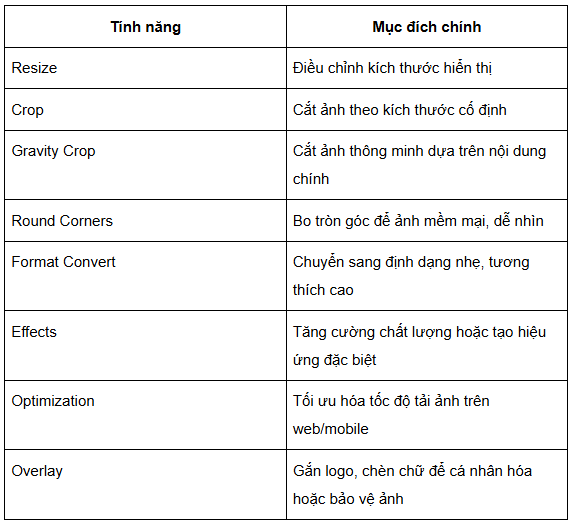
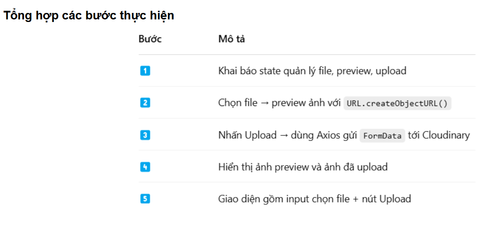

- useSelector dùng để đọc data từ store.
- useDispatch dùng để dispatch actions.


- createSlice cần params như sau:

+ name: là string, dùng để đặt tên cho slice.
+initialState: dùng để init value cho reducer.
+reducers: là các method để update value của state trong reducer.

**Chi tiết về các tính năng của Redux Toolkit:**

configureStore: Tạo store Redux với mặc định đã được cấu hình sẵn (như devtools, middleware,...).
createSlice: Tạo ra reducer và action cho một phần của state.
createAsyncThunk: xử lý bất đồng bộ (ví dụ: lấy dữ liệu từ API) dễ dàng.
Cung cấp sẵn những best practice trong cấu hình Redux.
1.2 Redux Saga là gì?
Redux Saga là một middleware của Redux, giúp quản lý các side effect phức tạp (như call API, tương tác với side effect) trong ứng dụng. Redux Saga sử dụng khái niệm "generator function" để quản lý logic bất đồng bộ dễ hiểu và có tổ chức.

Quản lý những luồng logic bất đồng bộ phức tạp (gọi API, điều phối nhiều action, concurrency, retry…).
Tách riêng logic side effect khỏi component và reducer, làm code dễ hiểu và dễ test hơn.
2. So sánh Redux Toolkit và Redux Saga
   Mặc dù Redux Toolkit và Redux Saga đều nhằm phục vụ ứng dụng Redux, chúng có những vai trò khác nhau:

2.1 Redux Toolkit
Redux Toolkit giúp bạn đơn giản hóa việc thiết lập và sử dụng Redux, giảm boilerplate và tự động cung cấp các best practice.

Lợi ích:

Tạo và quản lý store, state reducer dễ dàng.
createAsyncThunk giúp xử lý hành động async đơn giản (như gọi API).
Khi nào bạn nên dùng:

Khi bạn muốn thiết lập Redux nhanh chóng và chuẩn.
Khi ứng dụng chủ yếu yêu cầu logic bất đồng bộ đơn giản.
Khi bạn là người mới bắt đầu hoặc muốn code Redux gọn gàng, dễ bảo trì.
Ví dụ như nếu bạn đang build ứng dụng chỉ có logic bất đồng bộ đơn giản, cần fetch data và update state, createAsyncThunk là đủ.

2.2 Redux Saga
Redux Saga làm middleware cho Redux để quản lý side effect phức tạp và logic bất đồng bộ.

Lợi ích: sử dụng generator function để xử lý luồng side effect phức tạp:

nhiều API call đồng thời
retry, cancellation
quản lý logic phức tạp (like concurrency).
Khi nào bạn nên dùng:

Khi ứng dụng có logic bất đồng bộ phức tạp vượt quá khả năng của createAsyncThunk.
Khi cần kiểm soát luồng side effect chi tiết, sử dụng generator function để viết code rõ ràng hơn.
Khi cần các tính năng như debounce, throttle, retry, cancellation logic.
Ví dụ nếu ứng dụng có logic side effect phức tạp, cần concurrency, cancellation, retry thì bạn cần đến redux saga.


**B1:** Cấu hình store với Redux Toolkit
configureStore: tạo store với cấu hình sẵn, có thể thêm reducer.
RootState: lấy kiểu state root từ store.
AppDispatch: lấy kiểu cho dispatch.


**B2:** Cập nhật src/index.tsx để kết nối store với React:


**B3:** Tạo Slice và Reducer sử dụng Redux Toolkit

createSlice cho phép chúng ta tạo actions và reducers chỉ trong một nơi.
interface UserState: định nghĩa kiểu dữ liệu state user.
initialState: trạng thái ban đầu.
createSlice:

name: định danh slice (cần duy nhất trong root state).
reducers: nơi định nghĩa reducer. Ở đây có updateUser cập nhật state user.
userSlice.actions: tự động tạo action creators dựa trên reducer.
userSlice.reducer: reducer của slice, sẽ được thêm vào store.


**B4:** Thêm user: userReducer vào reducer.


**B5:** Tạo Async Thunk để xử lý logic bất đồng bộ. Ví dụ get user từ API
createAsyncThunk tạo action types (pending, fulfilled, rejected) tự động.
extraReducers: Sử dụng để xác định reducer tương ứng với action từ createAsyncThunk.
fetchUser: Logic bất đồng bộ fetch dữ liệu user từ API.


**B6:** Sử dụng state và dispatch action trong component React
useAppSelector((state) => state.user): trích xuất state user.
updateUser và fetchUser action được dispatch để cập nhật state.
useAppDispatch: Dispatch actions với kiểu chính xác (AppDispatch).
useAppSelector: Chọn state từ store với kiểu chính xác (RootState).

https://200lab.io/blog/huong-dan-su-dung-redux-trong-du-an-react

https://freetuts.net/xay-dung-ung-dung-crud-voi-redux-toolkit-5666.html

https://viblo.asia/p/react-cung-tim-hieu-ve-redux-toolkit-mot-phien-ban-moi-cua-redux-XL6lA6yg5ek


Mình giải thích chi tiết cho bạn nhé 👇

Trong Redux Toolkit (RTK), khi bạn dùng `createSlice`, bạn thường viết reducer như sau:

```ts
import { createSlice, type PayloadAction } from "@reduxjs/toolkit"

interface Student {
  id: number
  name: string
}

interface StudentState {
  students: Student[]
}

const initialState: StudentState = {
  students: []
}

const studentSlice = createSlice({
  name: "student",
  initialState,
  reducers: {
    setStudents: (state, action: PayloadAction<Student[]>) => {
      // action.payload sẽ có kiểu Student[]
      state.students = action.payload
    },
    addStudent: (state, action: PayloadAction<Student>) => {
      // action.payload sẽ có kiểu Student
      state.students.push(action.payload)
    }
  }
})

export const { setStudents, addStudent } = studentSlice.actions
export default studentSlice.reducer
```

---

### Giải thích:

1. **`PayloadAction<T>`**

   * Đây là một **generic type** mà Redux Toolkit cung cấp.
   * Nó giúp xác định kiểu dữ liệu của `action.payload`.

   Ví dụ:

   * `PayloadAction<Student[]>` nghĩa là: action khi dispatch sẽ mang theo `payload` có kiểu `Student[]`.
   * `PayloadAction<Student>` nghĩa là: action khi dispatch sẽ mang theo `payload` có kiểu `Student`.

2. **Công dụng**

   * Giúp **type an toàn**: khi bạn truy cập `action.payload`, TypeScript sẽ biết chính xác kiểu dữ liệu.
   * Tránh lỗi runtime do truyền sai dữ liệu.
   * Tự động hỗ trợ IntelliSense (gợi ý code) khi bạn viết reducer.

3. **Ví dụ cụ thể**

   * Nếu bạn dispatch như sau:

     ```ts
     dispatch(setStudents([{ id: 1, name: "An" }, { id: 2, name: "Bình" }]))
     ```

     thì `payload` là `Student[]`.

   * Còn khi bạn thêm 1 sinh viên:

     ```ts
     dispatch(addStudent({ id: 3, name: "Chi" }))
     ```

     thì `payload` là `Student`.

---

👉 Tóm lại:

* `PayloadAction<Student[]>`: dùng khi action mang **một mảng sinh viên**.
* `PayloadAction<Student>`: dùng khi action mang **một sinh viên duy nhất**.

---






Ok, câu này hay 👍 mình sẽ hệ thống lại toàn bộ **các thành phần cần thiết khi sử dụng Redux Toolkit** và giải thích **chúng liên kết với nhau như thế nào** trong một ứng dụng React.

---

# 🏗️ Các thành phần chính của Redux Toolkit

### 1. **Store**

* Là “kho trung tâm” lưu trữ toàn bộ state của ứng dụng.
* Được tạo bằng `configureStore()`.
* Nơi kết nối các **slice reducer** lại với nhau.

👉 Ví dụ:

```ts
import { configureStore } from '@reduxjs/toolkit'
import counterReducer from './counterSlice'
import userReducer from './userSlice'

export const store = configureStore({
  reducer: {
    counter: counterReducer,
    user: userReducer
  }
})
```

---

### 2. **Slice**

* Được tạo bằng `createSlice()`.
* Mỗi slice đại diện cho **một phần state** và cách thay đổi nó.
* Bao gồm:

    * `name`: tên slice.
    * `initialState`: state khởi tạo.
    * `reducers`: xử lý action nội bộ.
    * `extraReducers`: xử lý action từ bên ngoài (thường là async thunk).

👉 Ví dụ:

```ts
import { createSlice } from '@reduxjs/toolkit'

const counterSlice = createSlice({
  name: 'counter',
  initialState: { value: 0 },
  reducers: {
    increment: (state) => { state.value++ },
    decrement: (state) => { state.value-- }
  }
})

export const { increment, decrement } = counterSlice.actions
export default counterSlice.reducer
```

---

### 3. **Action**

* Là “tín hiệu” mô tả muốn thay đổi gì trong state.
* Redux Toolkit tự động sinh action từ `reducers` trong slice.
* Khi gọi `dispatch(action)` → action sẽ đi qua reducer để cập nhật state.

👉 Ví dụ:

```ts
dispatch(increment())    // state.value + 1
dispatch(decrement())    // state.value - 1
```

---

### 4. **Reducer**

* Là hàm nhận vào `state hiện tại` và `action`, sau đó trả về `state mới`.
* Trong Redux Toolkit, reducer nằm trong **slice**.
* Store kết hợp tất cả reducer từ nhiều slice.

---

### 5. **Async Thunk (`createAsyncThunk`)**

* Dùng để xử lý **logic bất đồng bộ** (call API, fetch dữ liệu...).
* Redux Toolkit tự sinh ra 3 action: `pending`, `fulfilled`, `rejected`.
* Các action này được lắng nghe trong `extraReducers`.

👉 Ví dụ:

```ts
import { createAsyncThunk } from '@reduxjs/toolkit'

export const fetchUser = createAsyncThunk(
  'user/fetchUser',
  async (id) => {
    const res = await fetch(`/api/users/${id}`)
    return res.json()
  }
)
```

---

### 6. **Provider**

* Component `Provider` của `react-redux` để “bọc” toàn bộ ứng dụng.
* Truyền `store` xuống cho tất cả component con.

👉 Ví dụ:

```tsx
import { Provider } from 'react-redux'
import { store } from './store'

function App() {
  return (
    <Provider store={store}>
      <MyComponent />
    </Provider>
  )
}
```

---

### 7. **Hooks (`useSelector`, `useDispatch`)**

* **`useSelector`**: lấy dữ liệu từ store.
* **`useDispatch`**: gửi action để thay đổi state.

👉 Ví dụ:

```tsx
import { useSelector, useDispatch } from 'react-redux'
import { increment } from './counterSlice'

function Counter() {
  const value = useSelector((state) => state.counter.value)
  const dispatch = useDispatch()

  return (
    <div>
      <p>{value}</p>
      <button onClick={() => dispatch(increment())}>Increase</button>
    </div>
  )
}
```

---

#  Mối liên hệ giữa các thành phần

1. **Slice** định nghĩa:

    * State (`initialState`)
    * Reducer logic (cách state thay đổi)
    * Action tương ứng

2. **Store** gom nhiều slice reducer → tạo thành state toàn cục.

3. **Provider** bọc app → cung cấp `store` cho React.

4. **useSelector** giúp component **đọc state** từ store.

5. **useDispatch** giúp component **gửi action** để thay đổi state.

6. **Action** đi vào **reducer trong slice** → tạo ra state mới.

7. Nếu có **async thunk** → khi dispatch nó sẽ chạy promise và tự động bắn ra `pending`, `fulfilled`, `rejected` → `extraReducers` lắng nghe để cập nhật state.

---

# Hình dung flow

```
Component -> dispatch(action) 
          -> Store chuyển action vào reducer
          -> Reducer cập nhật state
          -> Store thông báo state mới
          -> Component dùng useSelector nhận state mới và re-render
```

* **Slice** = định nghĩa state + logic thay đổi
* **Reducer** = thực thi thay đổi state
* **Action** = thông báo muốn thay đổi
* **AsyncThunk** = xử lý bất đồng bộ
* **Store** = gom toàn bộ state
* **Provider** = đưa store xuống toàn app
* **useSelector/useDispatch** = cầu nối giữa React component và Redux store

---